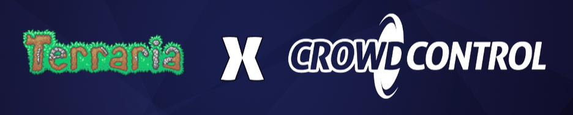
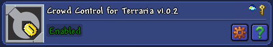

 
A mod for Terraria that allows the use of the [Crowd Control](https://crowdcontrol.live) Twitch extension. 
Crowd Control allows viewers of a Twitch stream to use Coins to cause events to happen in the streamer's game. 
Bits can be exchanged for Coins, rewarding the streamer. There are also free coins for viewers at the beginning of a Crowd Control session.

## Video: Terraria but viewers can affect the game, with GrandPOObear, Jaku and 5 others!

## Mod Installation
Search for, and download, the *Crowd Control for Terraria* mod in the Mod Browser in [tModLoader](https://store.steampowered.com/app/1281930/tModLoader/). Upon entering a Terraria world, the mod will begin trying to connect to the Crowd Control Desktop Application. You will receive a message in Terraria chat when the connection is established.
  
Alternatively, the mod can be downloaded manually from the [Releases](https://github.com/MrG-bit/TerrariaCrowdControlMod/releases/latest) tab. Place the *.tmod* file in the Mods folder located in "Documents>My Games>Terraria>ModLoader". You will then need to enable the mod in tModLoader.
  
The mod can be configured in-game through the Mod Configuration menu. One option worth noting is the ability to stop messages in Terraria chat from Crowd Control. This is helpful if you would like to use the Browser Source option instead through your streaming software.
 
 
 
Of course, you will also need to set up Crowd Control for your Twitch channel if you haven't already. More information about this can be found in the [Setup Guide](https://forum.warp.world/t/terraria-pc/16839). Put simply, you will need to download the [Crowd Control App](https://crowdcontrol.live/dashboard) and install the respective [Twitch Extension](https://dashboard.twitch.tv/extensions/7nydnrue11053qmjc6g0fd6einj75p) to your channel.

## Modes
* Singleplayer
* Multiplayer with other Crowd Control users

If the user hosting the server is running the Crowd Control mod, then any user who connects will automatically download and enable the mod. In other words, only the server host needs to download the mod.

## Effects Available
* Kill the player
* Explode the player
* Heal / damage the player
* Add / remove from the player's maximum HP and Mana
* Infinite mana / ammo
* Increase movement speed / jump height
* Teleport the player
* Reforge weapons and tools
* Shoot explosives / grenades
* Randomise projectile graphics
* Drop the player's items
* Give the player coins
* Give the player a random pet
* Spawn mobs
* Increase enemy spawnrate
* Buff / debuff the player
* Set time / speed-up time
* Flip the screen / fill the screen with fish?
* Rainbowfy the world
* Drunk mode
* and more ...

## Configuration
The mod can be configured through the in-game Mod Configuration menu. There are many settings to tweak to your liking. A few to highlight include:
* Show effect messages in chat: disable this to stop effect messages from showing in chat.
* Connect to crowd control: disable this to temporarily stop the mod from connecting to the Crowd Control Desktop Application.
* Disable tombstones: enable this to prevent tombstones from spawning when your player dies.
* Respawn time: configure the respawn timer to reduce the amount of time you have to wait before respawning.
* Allow time-changing effects during bosses: enable this to allow viewers to change the in-game time during boss fights, invasions or events.
* Allow teleporting to other players anytime: this allows you to teleport to other players on the server (using the fullscreen map).
* Spawn protection: explosive-related effects will be delayed when the player is too close to spawn.

## Contact & Support
You can follow the general setup guide at https://crowdcontrol.live/setup for extra help with the Crowd Control app or extension. If you have any questions or need help with the setup, please head over to the Crowd Control [forums](https://forum.warp.world/c/crowdcontrol) of [Discord](https://discord.warp.world/) for additional support.
 
If you have any questions, suggestions or issues regarding the Terraria mod, feel free to contact me on [Twitter](https://twitter.com/ggggg243) or Discord (MR.G#4963).

## Source
This repository contains the source for the mod. You are not allowed to use the source code to publish your own Crowd Control mod. You would be unable to add new effects because that is handled on the Crowd Control servers. 
I know the code is pretty messy in places. It's my first time working with Crowd Control and making a tModLoader mod. If I were to remake this mod again knowing what I do now, I would structure it a lot differently. That being said, I'm still happy with how it turned out. It's not the worst, that's for sure.

## Acknowledgements
* Crowd Control devs: being very supportive and welcoming (especially Jaku!)
* tModLoader Discord users: helping me with coding in the tModLoader API
* Oli: drunk mode screen shaders (SH_Sine and SH_Glitch)

## Links
* [Crowd Control](https://crowdcontrol.live)
* [Terraria](https://store.steampowered.com/app/105600/Terraria/)
* [tModLoader](https://store.steampowered.com/app/1281930/tModLoader/)
